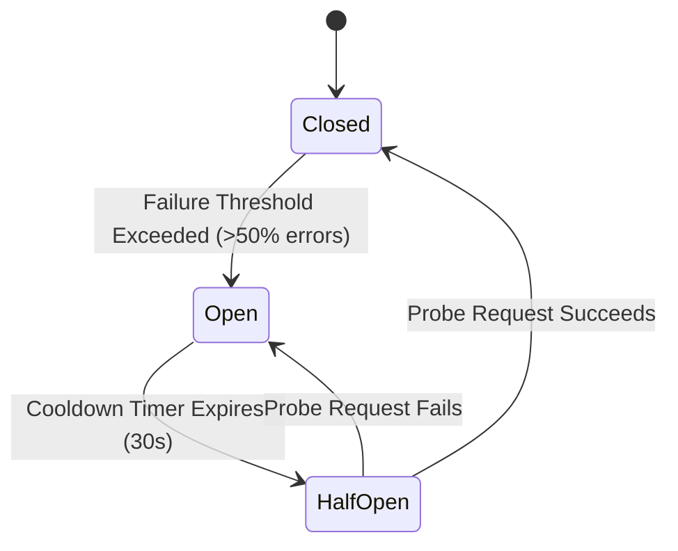

# Production Architecture, Corner Cases & System Design Decisions

> **Technical Reference & Interview Guide**:  
> This document details the technical engineering decisions, distributed system corner cases, concurrency controls, and resilience strategies implemented across Macro Tracker. It is structured as an architectural reference for production design and technical interview discussions at top-tier product companies.

---

## 1. Multi-Tier Distributed Rate Limiting & Sybil Attack Defense

### Architectural Strategy:
- **Algorithm**: Sliding Window Counter via Upstash Redis.
- **Why Sliding Window over Token Bucket/Fixed Window**:
  Fixed windows suffer from the $2\times$ boundary burst vulnerability (e.g., sending 10 requests at 11:59:59 PM and 10 at 12:00:00 AM, totaling 20 requests in 1 second). Sliding window counter calculates the weighted sum of the current and previous windows, guaranteeing smooth request distribution.

### Multi-Tiered Quota Architecture:
1. **Tier 1: Global Sybil & DDoS Barrier**:
   - `100 req/min` across all edge functions.
   - Prevents distributed botnets from exhausting Supabase Edge isolates or exhausting connection pools.
2. **Tier 2: Per-User Burst Limiter**:
   - `10 req/min` on `log-meal`, `5 req/min` on `scan-food` / `log-exercise`.
   - Protects against rapid button spamming and UI race conditions.
3. **Tier 3: Daily Consumption Cap**:
   - `30 meals/day`, `15 scans/day`, `10 feedback submissions/day`.
   - Enforces cost controls on cloud infrastructure.
4. **Tier 4: Third-Party AI Quota (Free Tier vs. BYOK)**:
   - Free users: `3 req/min` and `6 req/day` for Gemini 2.5 Flash.
   - BYOK users: Personal Gemini API key is decrypted and authenticated, bypassing platform AI rate limits while retaining edge function burst protection.

### Standardized `429 Too Many Requests` Contract:
- All rate-limited responses return `HTTP 429` with `Retry-After: <seconds>` headers and JSON payload containing `retry_after_seconds` and specific reset times, allowing the client to show deterministic countdown timers.

---

## 2. Distributed Latency Optimization & Cold-Socket Mitigation

### The Problem (487ms Cold Latency):
- Sequential HTTP calls from edge functions to Redis (`await global` $\to$ `await burst` $\to$ `await daily`) created a $3 \times \text{RTT}$ waterfall.
- After idle periods, TCP/TLS connections to serverless Redis timed out, requiring DNS lookup + TCP 3-way handshake + TLS 1.3 negotiation on each request.
- Per-request instantiation wiped in-memory caches on every invocation.

### The Engineering Solution:
1. **Parallel Execution via `Promise.all`**:
   - Concurrently evaluates global, burst, and daily limits in a single network round-trip ($3\times \text{RTT} \to 1\times \text{RTT}$), reducing Redis overhead by ~66%.
2. **Module-Scoped Singletons**:
   - Instantiating `Redis` and `Ratelimit` instances at Deno module scope preserves HTTP keep-alive connections across warm isolate invocations.
3. **Persistent Ephemeral In-Memory Cache**:
   - In-memory `ephemeralCache` (LRU Map) stores recent token counts within the isolate, serving repeated checks in **0ms** without touching the Redis network socket.

---

## 3. Idempotency & Network Retries (At-Most-Once Execution)

### Edge Case:
Under unstable cellular network conditions, a client may send a request, the server executes it, but the TCP connection drops before the HTTP response reaches the client. If the client automatically retries, duplicate meals or AI scans would be billed/logged twice.

### Technical Implementation:
1. **Client-Generated UUIDv4 Idempotency Key**:
   - The mobile client generates a unique `idempotency_key` (UUIDv4) attached to `x-idempotency-key` header or request body.
2. **Atomic Redis Reservation with TTL**:
   - The edge function checks `idempotent:<fn>:<user_id>:<key>`.
   - If present, returns the cached result immediately ($< 20\text{ ms}$, `X-Cache: HIT`) without re-running AI inference or deducting user quota.
   - If absent, executes the transaction, writes to Redis with a `10-minute TTL` (`SETEX`), and commits to PostgreSQL.
3. **Database-Level Deduplication**:
   - PostgreSQL RPC `insert_meal_transaction` accepts `p_client_meal_id`. If `meal_entries` already contains that ID for the user, it skips re-insertion and returns the existing row idempotently.

---

## 4. Timezone Midnight Boundaries & Zero-State Synchronization

### The Problem:
- PostgreSQL and Supabase servers operate in UTC.
- A user logging meals or walking in IST (`GMT+05:30`) at `12:30 AM` on August 31 local time is still at `7:00 PM` on August 30 in UTC.
- Defaulting to PostgreSQL `CURRENT_DATE` or `now()::date` attributes actions to *yesterday*, causing newly logged meals/exercises to disappear from today's dashboard upon refresh.

### Technical Solution:
1. **Client-Side Local Day Slicing (`dateUtils.ts`)**:
   - Local date is computed strictly using the device's local calendar year, month, and day (`YYYY-MM-DD`).
   - Generates exact ISO 8601 start (`00:00:00.000`) and end (`23:59:59.999`) timestamps in local time.
2. **Explicit `summary_date` Column**:
   - `meal_entries`, `exercises`, and `daily_summaries` explicitly store `summary_date date` passed from the client's local context, superseding UTC server defaults.
3. **Hybrid DB Query with Fallback**:
   - Dashboard queries match: `or(summary_date.eq.${dateStr}, and(created_at.gte.${startIso}, created_at.lte.${endIso}))`.
   - Guarantees seamless backward compatibility for historical rows while strictly isolating local days.

---

## 5. Single Source of Truth vs. Materialized Aggregations (Race Condition Elimination)

### The Problem:
- `daily_summaries` acts as a materialized aggregate table (CQRS read-model) to speed up analytics queries.
- If a user deletes multiple meals in rapid succession, firing multiple concurrent asynchronous delete RPCs, network responses can arrive out-of-order.
- If the client re-queries `daily_summaries` after delete #1 finishes while delete #2 is still in-flight, stale aggregate data (e.g. 156 kcal) overwrites the client state even when the UI meal list is completely empty.

### The Architectural Solution:
1. **Ground-Truth UI State Derivation**:
   - The client derives total calories and macros directly from the active array of meal entries loaded on screen:
     $$\text{Total Eaten} = \sum_{e \in \text{LoadedEntries}} e.\text{calories}$$
   - When all entries are removed, eaten calories are **guaranteed to be 0**, mathematically preventing phantom/stale summary data.
2. **Optimistic Local Mutation + In-Flight Mutex**:
   - `handleDeleteEntry` mutates local state instantly and uses `pendingDeletesRef (Set<string>)` to prevent duplicate click dispatching.
   - Asynchronous server sync runs in the background; full data refresh is triggered **only** if the server returns an explicit error (Rollback on Failure).

---

## 6. Binary Multipart Streaming vs. Base64 Memory Overhead

### The Problem:
- Encoding 1080p food photos as Base64 strings introduces a **33% data transfer penalty** (a 3MB image becomes 4MB).
- In React Native (Hermes engine), instantiating large Base64 strings causes sudden heap allocation spikes, triggering GC pauses and frame drops on low-to-mid-tier mobile hardware.

### The Technical Solution:
1. **Binary `multipart/form-data`**:
   - Images are uploaded as native binary streams via `FormData`, avoiding Base64 encoding completely.
2. **Progressive XHR Upload Tracking**:
   - Uses `XMLHttpRequest.upload.onprogress` and `onload` to track exact socket-level byte progression.
   - Provides deterministic UI state transitions:
     $$\text{Upload Progress } (0\% \to 100\%) \implies \text{Edge Ingestion} \implies \text{Gemini Multimodal Inference}$$

---

## 7. Fail-Open Architecture & Graceful Degradation

### System Design Principle:
> *A non-critical service failure (e.g. caching or rate-limiting) must never cause a complete outage of core application capabilities.*

### Implementation:
1. **Redis Fail-Open Handler**:
   - All Redis rate-limiting calls are wrapped in defensive `try/catch` blocks.
   - If Upstash Redis experiences network partitions, DNS timeouts, or outage, the error is logged as a warning (`console.warn`) and the request is permitted through ("Fail-Open").
2. **Database Fallback for Health Connect**:
   - If Google Health Connect permissions are revoked or unavailable, the system transparently falls back to stored database step records without crashing dashboard components.

---

## 8. Multi-Layer Defensive Validation (Client $\to$ Edge $\to$ Database)

```
[Mobile Client]             [Supabase Edge Function]          [PostgreSQL Database]
  • Input Masking             • Payload Size Check (<3MB)       • Check Constraints
  • Char Limits (10-1000)     • Cryptographic JWT Auth          • Foreign Key Cascades
  • >0 Calorie Filtering      • String Trimming & Bounds        • Transactional RPC
  • Optimistic Dedupe         • Redis Sliding Window            • Atomic UPSERTs
```

1. **Client Layer**:
   - Validates character bounds (Title 3–100, Description 10–1,000) and suppresses save actions on empty/0-calorie meals.
2. **Edge Function Layer**:
   - Rejects payloads exceeding 3MB before Deno allocates memory (`Content-Length` inspection).
   - Validates types against strict schema (`'bug' | 'feedback'`).
3. **Database Layer (ACID Guarantees)**:
   - Table-level `CHECK (char_length(title) >= 3 AND char_length(title) <= 100)`.
   - `insert_meal_transaction` executes atomically: inserts meal header, loops through food items, filters zero/negative quantities, and updates `daily_summaries` inside a single database transaction.

---

## 9. Circuit Breaker Pattern for External Service Outages

### What is a Circuit Breaker?
A resilience design pattern that wraps remote calls (e.g., to Gemini API or external AI vendors). It monitors failure rates across three distinct states:
1. **CLOSED**: Requests flow normally. Failures are counted within a sliding time window.
2. **OPEN**: When the failure rate exceeds the threshold (e.g., $>50\%$ failures over 10 requests, or consecutive 503s), the circuit trips. Subsequent requests fail fast in **$<1\text{ms}$** without waiting for network timeouts.
3. **HALF-OPEN**: After a cooldown period (e.g., 30s), a single probe request is permitted. If it succeeds, the circuit resets to CLOSED; if it fails, the OPEN timer resets.



### Why Circuit Breakers are Essential in High-Volume Systems:
- **Prevents Cascading Failure**: When Gemini experiences high demand (503 / 429), each un-breakered request hangs for 10–30 seconds waiting for upstream timeouts. Under high concurrency (e.g. 500 req/s), edge worker memory and socket pools exhaust rapidly, taking down the entire API gateway.
- **Immediate Graceful Fallback**: With an OPEN circuit, the edge function immediately responds with a structured fallback (e.g., *"AI estimation is temporarily experiencing high demand. Please use Quick Add or try again in 30 seconds"*), protecting backend compute resources.

---

## 10. Database Indexing & Concurrency Controls

| Table | Index / Constraint | Engineering Rationale |
| :--- | :--- | :--- |
| `meal_entries` | `(user_id, summary_date)` | Speeds up daily dashboard filtering from $O(N)$ sequential scan to $O(\log N)$ index scan. |
| `meal_entries` | `(user_id, created_at DESC)` | Optimizes chronological meal history queries and timeline pagination. |
| `daily_summaries` | `UNIQUE (user_id, summary_date)` | Enables atomic `INSERT ... ON CONFLICT DO UPDATE` for lock-free aggregated totals. |
| `weight_logs` | `UNIQUE (user_id, log_date)` | Guarantees exactly one weight entry per day per user, preventing duplicate plot points. |
| `exercises` | `UNIQUE (user_id, external_id)` | Prevents duplicate step syncs from Health Connect / wearable devices on multiple app opens. |
| `feedback_submissions` | `(user_id, created_at DESC)` | Efficient rate-checking and per-user audit trails. |
| `feedback_submissions` | `(status, type)` | Enables sub-millisecond filtering for administrative triage boards. |
